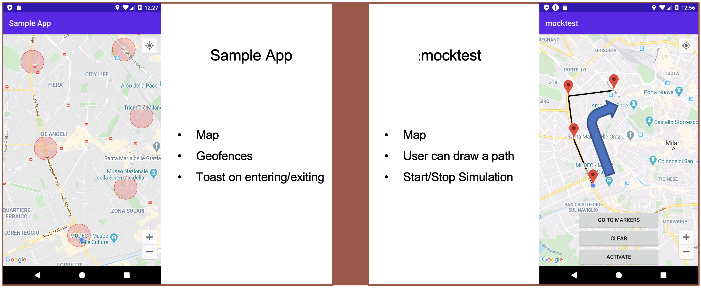

# Droidcon Mock Location
An integrable module to simulate a coordinate path for your geolocated project.

This project was created to allow the developer to integrate the :mocktest module into their project. This module adds a second icon on the desktop of the device where the project is executed. Through this second icon it is possible to launch an activity to configure a fake GPS simulation and launch it.

  

  

Once the simulation is launched, the whole device will receive the new position updates according to the settings of the saved path.

This fake gps simulation will allow you to provide your customer with an internal code to perform GPS simulations, you will not have to force him to download third-party applications.